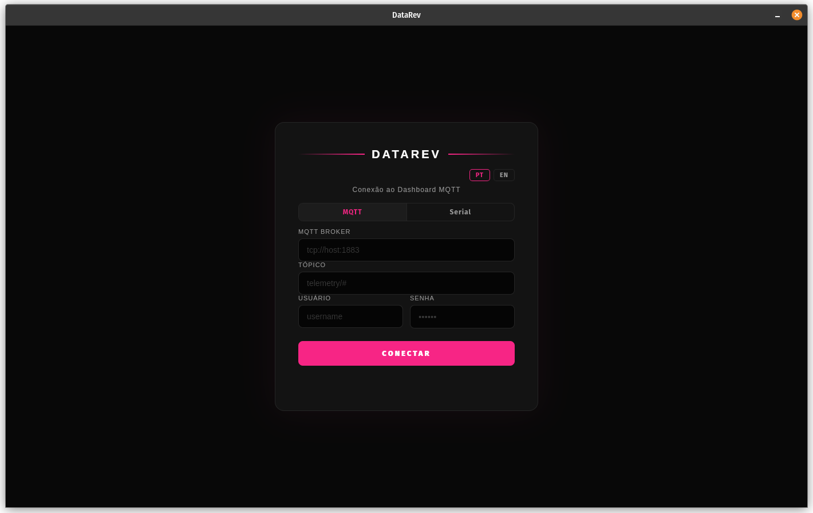
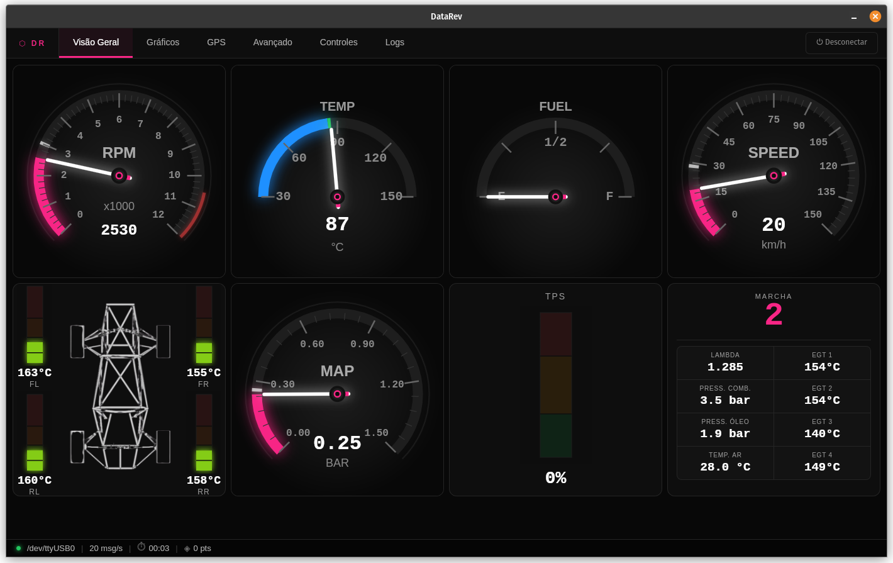
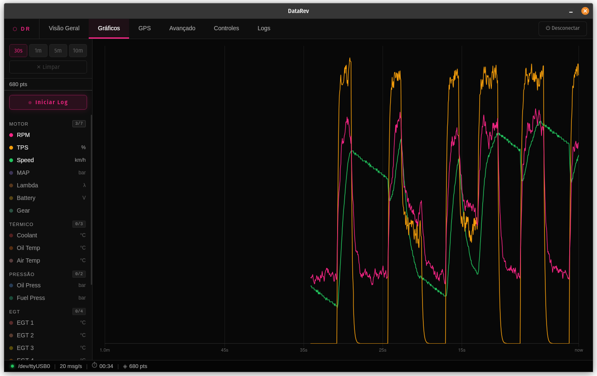
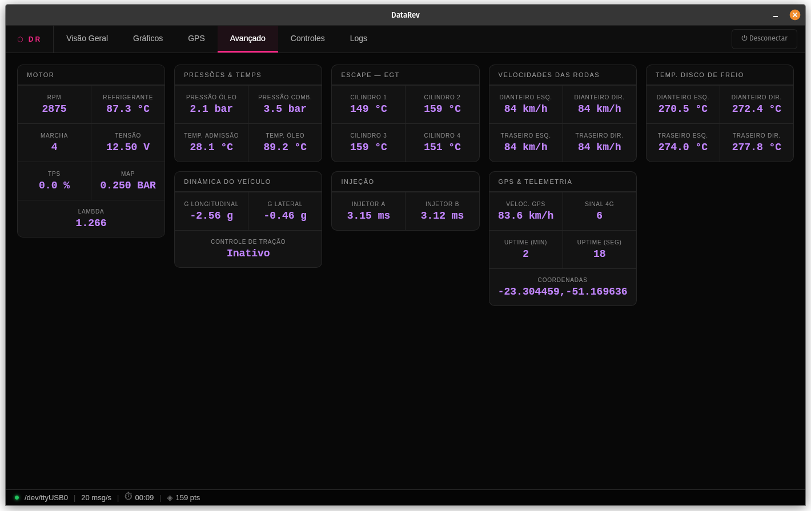
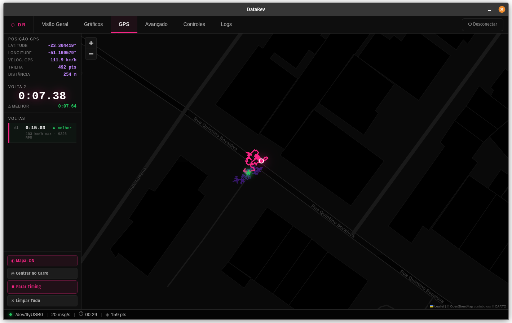
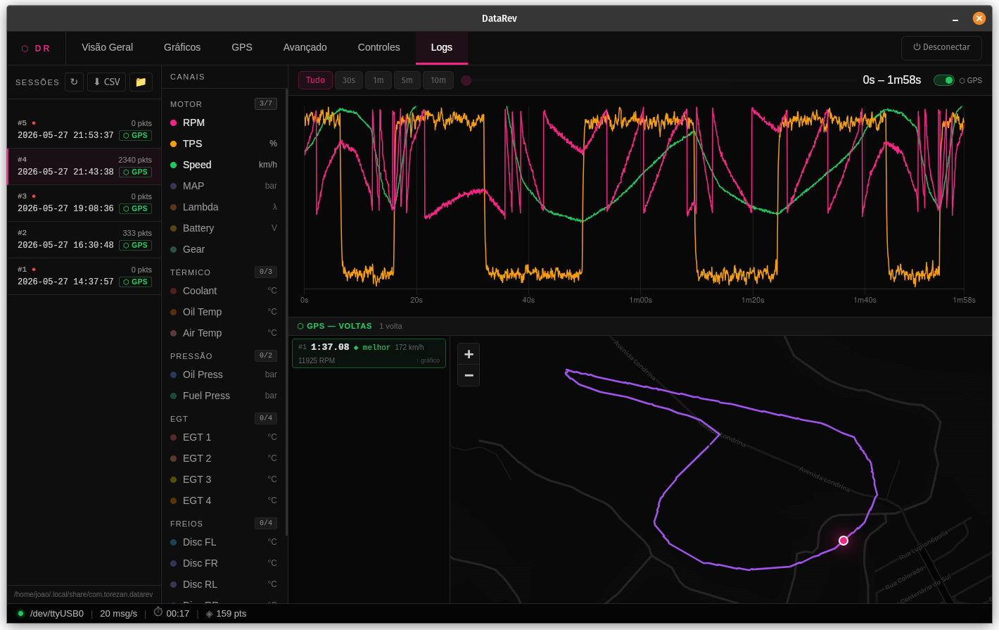
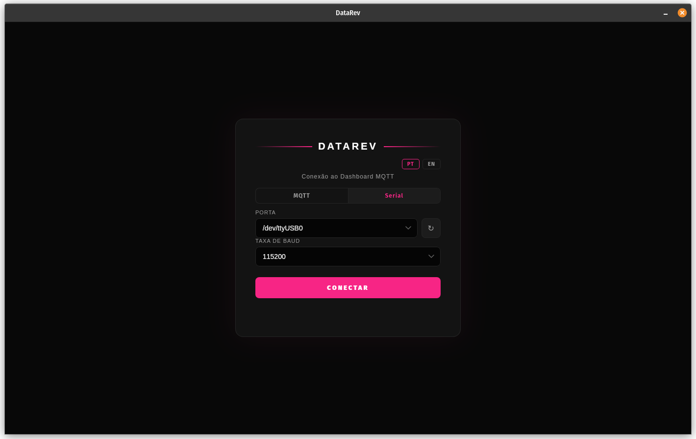

# DataRev

Real-time motorsport telemetry dashboard. Receives data over MQTT or USB serial, displays gauges, records sessions to SQLite, and shows live GPS track with lap timing.

---

## Screenshots

| Connection | Overview |
|---|---|
|  |  |

| Graphs | Advanced |
|---|---|
|  |  |

| GPS & Lap Timing | Session Logs |
|---|---|
|  |  |

**Serial connection**


---

## Table of Contents

1. [Stack](#stack)
2. [Architecture](#architecture)
3. [Features](#features)
4. [Telemetry Payload](#telemetry-payload)
5. [Database Schema](#database-schema)
6. [Tauri Commands (API)](#tauri-commands-api)
7. [Frontend Internals](#frontend-internals)
8. [Installation](#installation)
9. [Development](#development)
10. [Release Build (CI)](#release-build-ci)
11. [Project Structure](#project-structure)

---

## Stack

| Layer | Technology |
|---|---|
| Desktop shell | [Tauri v2](https://tauri.app) |
| Backend | Rust (stable) |
| Frontend | Vanilla HTML / CSS / JavaScript — no bundler |
| MQTT client | [rumqttc 0.24](https://github.com/bytebeamio/rumqtt) (pure-Rust, rustls TLS) |
| Serial | [serialport 4](https://github.com/serialport/serialport-rs) |
| Database | SQLite via [rusqlite 0.31](https://github.com/rusqlite/rusqlite) (bundled, no system lib) |
| Timestamps | [chrono 0.4](https://github.com/chronotope/chrono) |
| File dialogs | [rfd 0.14](https://github.com/PolyMeilex/rfd) |
| Maps | [Leaflet.js 1.x](https://leafletjs.com) + CartoDB dark tiles |
| Charts | [Chart.js 4.x](https://www.chartjs.org) |
| Tile source | CartoDB dark\_all (OSM data) |

---

## Architecture

```
┌─────────────────────────────────────────────────────────┐
│  Tauri WebView  (WebKit2GTK on Linux, WebView2 on Win)  │
│                                                         │
│  src/index.html  ──  src/styles.css  ──  src/main.js   │
│                                                         │
│  Tauri IPC ──────────────────────────────────────────── │
│  invoke()   (JS → Rust command)                         │
│  listen()   (Rust → JS event)                           │
└──────────────────────────┬──────────────────────────────┘
                           │
┌──────────────────────────▼──────────────────────────────┐
│  src-tauri/src/lib.rs  — Rust backend                   │
│                                                         │
│  ┌─────────────┐   ┌────────────┐   ┌────────────────┐  │
│  │ MqttState   │   │SerialState │   │ DatalogState   │  │
│  │ AsyncClient │   │ AtomicBool │   │ mpsc::Sender   │  │
│  └──────┬──────┘   └─────┬──────┘   └───────┬────────┘  │
│         │                │                  │           │
│  rumqttc eventloop  serialport read   background thread │
│  emits "telemetry"  emits "telemetry"  writes SQLite    │
│  emits "mqtt-disconnected"   emits "serial-disconnected"│
└─────────────────────────────────────────────────────────┘
                           │
                    SQLite  (datarev.db)
                    in app data directory
```

### Event flow

1. **Connect** — user fills in MQTT broker + topic (or selects a serial port) and clicks Connect.
2. **test\_connection** (MQTT only) — backend verifies connectivity before switching screens.
3. **\_initDashboard()** — tears down any previous session (unlisteners, intervals, ResizeObservers), re-creates all gauges and charts, registers fresh Tauri event listeners.
4. **Telemetry loop** — Rust parses each incoming message, emits `"telemetry"` with the full payload struct. JS receives it via `listen()` and calls `applyTelemetry()`.
5. **Datalog** — optional; user clicks "Start Log". Backend opens a dedicated background thread that receives packets from an `mpsc` channel and writes them to SQLite. Stopping the log sends `LogMsg::Stop` through the channel, which finalises the session row.
6. **GPS timing** — can be started independently or auto-started with the log button. The `LeafletGPSMap` class tracks every GPS fix, detects finish-line crossings with haversine distance, and calls `save_lap` on each completed lap.

---

## Features

### Overview tab
- **RPM gauge** — 270° arc, 0–12 000 RPM, red section above 10 500. Peak marker.
- **Speed gauge** — 270° arc, 0–150 km/h (front-right wheel speed).
- **MAP gauge** — 270° arc, 0–1.5 bar manifold pressure.
- **Coolant temp** — 180° semi-gauge with colour zones (cold / normal / hot).
- **Fuel level** — 180° semi-gauge E–F with custom labels.
- **TPS** — vertical linear bar gauge with green / amber / red zones.
- **Brake disc temps** — four vertical bars (FL / FR / RL / RR), 0–600 °C with zone colouring.
- **Tile strip** — gear indicator, lambda, fuel pressure, oil pressure, air temp, EGT × 4.
- Tile borders turn amber (warn) or red (danger) on threshold crossings.

### Graphs tab
- Real-time Chart.js line chart, time-axis scrolling window (30 s / 1 m / 2 m / 5 m / 10 m).
- 24 channels available; toggle individually or by group (Engine, Thermal, Pressure, EGT, Brakes, Dynamics).
- Each channel gets its own hidden Y-axis so scales never interfere.
- In-memory `HistoryBuffer` keeps 10 minutes of data using a binary-search trim.
- "Start Log / Stop Log" button — records to SQLite and links GPS session if timing is active.

### GPS tab
- **Live track** on Leaflet with CartoDB dark tiles (enabled by default).
- Car position dot + session-start star marker.
- **Lap timing** — place the finish line once, then every crossing is auto-detected (10 m radius, > 15 s minimum lap, 8 s crossing cooldown).
- Lap table shows time, Δ best, max speed, max RPM. Click a row to highlight that lap on the map.
- Completed lap traces drawn in a cycling colour palette.
- GPS session and laps are persisted to SQLite together with the telemetry log session.
- "Clear All" resets map, laps, and optionally stops the log.

### Advanced tab
Full numeric readout of all 33 telemetry channels, grouped into cards:
Engine · Pressures & Temps · EGT · Wheel Speeds · Brake Disc Temps · Vehicle Dynamics · Injection · GPS & Telemetry.

### Logs tab
- Session browser — lists all recorded log sessions (newest first), with packet count and GPS badge if GPS laps are linked.
- Select a session to view it in a Chart.js viewer with zoom (15 s … full) and pan scrubber.
- GPS laps section — shows lap table and lap traces on a separate Leaflet map. Click a lap row to jump the chart to that lap.
- **Export CSV** — native save-file dialog, writes all 35 telemetry columns.
- "Open logs folder" — opens the app data directory in the OS file manager.

### Internationalisation
Full PT/EN strings via a simple `I18N` object. Language persisted in `localStorage`. All static elements use `data-i18n` / `data-i18n-title` attributes; dynamic elements are updated by `applyI18n()`.

---

## Telemetry Payload

Both MQTT and serial use the same wire format: **33 fields separated by `/`**, terminated by `\n` on serial.

```
rpm / temp / bat / gear / lambda / tps / map_val / air_temp /
oil_pressure / fuel_pressure / oil_temp /
speed_fl / speed_fr / speed_rl / speed_rr /
trac_ctrl_cut /
g_force_a / g_force_l /
inj_time_a / inj_time_b /
egt1 / egt2 / egt3 / egt4 /
brake_disc_temp_fl / brake_disc_temp_fr / brake_disc_temp_rl / brake_disc_temp_rr /
signal / gps_speed / minutes / seconds / gps_pos
```

| Field | Type | Unit | Description |
|---|---|---|---|
| `rpm` | `i32` | RPM | Engine speed |
| `temp` | `f64` | °C | Coolant temperature |
| `bat` | `f64` | V | Battery voltage |
| `gear` | `i32` | — | Current gear (0 = neutral) |
| `lambda` | `f64` | λ | Air-fuel ratio (stoich = 1.0) |
| `tps` | `f64` | % | Throttle position |
| `map_val` | `f64` | bar | Manifold absolute pressure |
| `air_temp` | `f64` | °C | Intake air temperature |
| `oil_pressure` | `f64` | bar | Oil pressure |
| `fuel_pressure` | `f64` | bar | Fuel pressure |
| `oil_temp` | `f64` | °C | Oil temperature |
| `speed_fl` | `i32` | km/h | Wheel speed — front left |
| `speed_fr` | `i32` | km/h | Wheel speed — front right |
| `speed_rl` | `i32` | km/h | Wheel speed — rear left |
| `speed_rr` | `i32` | km/h | Wheel speed — rear right |
| `trac_ctrl_cut` | `i32` | bool | Traction control cut active (0/1) |
| `g_force_a` | `f64` | g | Longitudinal G-force |
| `g_force_l` | `f64` | g | Lateral G-force |
| `inj_time_a` | `f64` | ms | Injector A pulse width |
| `inj_time_b` | `f64` | ms | Injector B pulse width |
| `egt1`–`egt4` | `f64` | °C | Exhaust gas temp, cylinders 1–4 |
| `brake_disc_temp_fl/fr/rl/rr` | `f64` | °C | Brake disc temperatures |
| `signal` | `i32` | dBm | 4G/LTE signal strength |
| `gps_speed` | `f64` | km/h | GPS-derived speed |
| `minutes` | `i32` | min | ECU uptime minutes |
| `seconds` | `i32` | s | ECU uptime seconds |
| `gps_pos` | `String` | — | `"lat,lon"` decimal degrees |

### MQTT topic
The backend subscribes to the topic you provide in the login screen. QoS AtLeastOnce. Each message payload must contain exactly 33 `/`-separated fields.

### Serial
Standard UART framing — one line per packet, `\n` terminated. Baud rate selectable in the UI (common values: 9600, 115200, 250000, 500000, 1 000 000). The backend reads byte-by-byte with a 200 ms timeout and parses complete lines.

---

## Database Schema

The database is stored at the OS app data directory as `datarev.db` (SQLite, WAL mode).

```sql
-- One row per telemetry recording session
CREATE TABLE log_sessions (
    id           INTEGER PRIMARY KEY AUTOINCREMENT,
    started_at   TEXT    NOT NULL,   -- ISO 8601 UTC
    stopped_at   TEXT,               -- NULL while recording
    packet_count INTEGER NOT NULL DEFAULT 0
);

-- One row per telemetry packet (all 33 channels + timestamps)
CREATE TABLE telemetry (
    id                  INTEGER PRIMARY KEY AUTOINCREMENT,
    session_id          INTEGER NOT NULL REFERENCES log_sessions(id),
    ts                  TEXT    NOT NULL,   -- ISO 8601 UTC
    ts_ms               INTEGER NOT NULL DEFAULT 0,  -- Unix ms
    rpm                 INTEGER,
    temp                REAL,
    bat                 REAL,
    gear                INTEGER,
    lambda              REAL,
    tps                 REAL,
    map_val             REAL,
    air_temp            REAL,
    oil_pressure        REAL,
    fuel_pressure       REAL,
    oil_temp            REAL,
    speed_fl            INTEGER,
    speed_fr            INTEGER,
    speed_rl            INTEGER,
    speed_rr            INTEGER,
    trac_ctrl_cut       INTEGER,
    g_force_a           REAL,
    g_force_l           REAL,
    inj_time_a          REAL,
    inj_time_b          REAL,
    egt1                REAL,
    egt2                REAL,
    egt3                REAL,
    egt4                REAL,
    brake_disc_temp_fl  REAL,
    brake_disc_temp_fr  REAL,
    brake_disc_temp_rl  REAL,
    brake_disc_temp_rr  REAL,
    signal              INTEGER,
    gps_speed           REAL,
    minutes             INTEGER,
    seconds             INTEGER,
    gps_pos             TEXT
);

-- GPS track sessions (linked 1-to-1 with a log_session)
CREATE TABLE gps_sessions (
    id             INTEGER PRIMARY KEY AUTOINCREMENT,
    started_at     TEXT    NOT NULL,
    stopped_at     TEXT,
    label          TEXT,
    lap_count      INTEGER NOT NULL DEFAULT 0,
    log_session_id INTEGER REFERENCES log_sessions(id)
);

-- Individual laps within a GPS session
CREATE TABLE laps (
    id             INTEGER PRIMARY KEY AUTOINCREMENT,
    gps_session_id INTEGER NOT NULL REFERENCES gps_sessions(id) ON DELETE CASCADE,
    lap_number     INTEGER NOT NULL,
    started_at     TEXT    NOT NULL,
    started_at_ms  INTEGER,           -- Unix ms, for chart navigation
    duration_ms    INTEGER NOT NULL,
    max_speed_kmh  REAL,
    avg_speed_kmh  REAL,
    max_rpm        INTEGER,
    gps_points     TEXT               -- JSON: [[lat, lon], ...]
);
```

Migrations (`ALTER TABLE`) are applied silently on every open — safe to run against older database files.

---

## Tauri Commands (API)

All commands are called from JS via `invoke('command_name', { ...args })`.

### Connection

| Command | Args | Returns | Description |
|---|---|---|---|
| `test_connection` | `broker`, `username`, `password` | `bool` | Attempt MQTT connect, return true if ConnAck received within 30 polls |
| `connect_mqtt` | `broker`, `topic`, `username`, `password` | `()` | Open MQTT session, subscribe, start background event loop |
| `disconnect_mqtt` | — | `()` | Disconnect MQTT client |
| `list_serial_ports` | — | `Vec<String>` | List available serial port names |
| `connect_serial` | `port_name`, `baud_rate` | `()` | Open serial port, start read loop |
| `disconnect_serial` | — | `()` | Signal the serial read loop to exit |

Both `connect_mqtt` and `connect_serial` emit the Tauri event `"telemetry"` for every valid packet, and `"mqtt-disconnected"` / `"serial-disconnected"` on failure.

### Datalog

| Command | Args | Returns | Description |
|---|---|---|---|
| `start_log` | — | `i64` | Create session row, start background write thread, return session id |
| `stop_log` | — | `()` | Send Stop message to writer thread; thread finalises session row |
| `log_is_active` | — | `bool` | True if a write thread is running |
| `list_sessions` | — | `Vec<SessionInfo>` | All sessions newest first, with `has_gps` flag |
| `get_session_data` | `session_id` | `Vec<TelemetryRow>` | All telemetry rows for a session |
| `export_session_csv` | `session_id` | `String` | Open native save dialog, write CSV, return path |
| `get_log_dir` | — | `String` | App data directory path |
| `open_log_dir` | — | `()` | Open app data directory in OS file manager |

### GPS sessions

| Command | Args | Returns | Description |
|---|---|---|---|
| `start_gps_session` | `label?`, `log_session_id?` | `i64` | Insert gps\_sessions row, return id |
| `end_gps_session` | `gps_session_id` | `()` | Set stopped\_at timestamp |
| `save_lap` | `gps_session_id`, `lap_number`, `started_at`, `started_at_ms?`, `duration_ms`, `max_speed_kmh?`, `avg_speed_kmh?`, `max_rpm?`, `gps_points?` | `i64` | Insert lap row, update lap\_count on session |
| `list_gps_sessions` | — | `Vec<GpsSessionInfo>` | All GPS sessions |
| `get_gps_session_for_log` | `log_session_id` | `Option<GpsSessionWithLaps>` | GPS session linked to a log session, with laps |
| `list_laps_for_session` | `gps_session_id` | `Vec<LapInfo>` | All laps for a GPS session |
| `get_lap_points` | `lap_id` | `Option<String>` | Raw JSON GPS points for a lap |
| `delete_gps_session` | `gps_session_id` | `()` | Delete GPS session + laps (CASCADE) |

### CSV column layout

```
timestamp, ts_ms, rpm, coolant_temp_c, battery_v, gear, lambda, tps_pct, map_bar,
air_temp_c, oil_pressure_bar, fuel_pressure_bar, oil_temp_c,
speed_fl_kmh, speed_fr_kmh, speed_rl_kmh, speed_rr_kmh,
trac_ctrl_cut, g_force_lon_g, g_force_lat_g,
inj_time_a_ms, inj_time_b_ms,
egt1_c, egt2_c, egt3_c, egt4_c,
disc_temp_fl_c, disc_temp_fr_c, disc_temp_rl_c, disc_temp_rr_c,
signal, gps_speed_kmh, uptime_min, uptime_sec, latitude, longitude
```

---

## Frontend Internals

### Classes

**`HistoryBuffer`**
Rolling time-series store (default 10 min). Uses binary search for both `push()` (trim old data) and `window(seconds)` (slice recent data). Never allocates more than needed.

**`ArcGauge`** (270° sweep)
Used for RPM, Speed, MAP. Canvas-rendered with:
- Radial gradient background
- Section arcs (coloured zone markers on the outer ring)
- Segmented progress arc with per-segment glow (`shadowBlur`)
- Peak marker (white blip)
- Minor + major tick marks with numeric labels
- Animated needle (RAF-based easing, 20% per frame)
- Centre knob layers drawn last (topmost)
- `ResizeObserver` for HiDPI / responsive layout

**`SemiGauge`** (180° sweep)
Used for Fuel level and Coolant temp. Same rendering pipeline, supports `customLabels` (E / ½ / F etc.).

**`LinearGauge`** (vertical bar)
Used for TPS and brake disc temperatures. No animation — direct `setValue()` → `_draw()`.

**`TelemetryChart`**
Chart.js wrapper. Each active channel gets its own hidden Y-axis keyed `y_<channelName>` to keep scales independent. X-axis is a linear millisecond axis labelled as relative time. Destroyed and recreated on every `_initDashboard()` call.

**`LeafletGPSMap`**
Leaflet map with two polylines (full session track in dim purple, current lap in pink). Lap timing:
1. On `startTiming()`, the finish line is placed at the current car position.
2. `pushPoint()` → `_checkCrossing()`: haversine distance < 10 m from finish line, lap duration > 15 s, global 8 s crossing cooldown.
3. `_completeLap()`: gathers stats from `HistoryBuffer`, calls `save_lap`, draws the completed lap trace in a colour from the palette, auto-starts the next lap.

### Reconnect safety

`_initDashboard()` does a full teardown before reinitialising:

```js
_unlisteners.forEach(fn => fn());  // unlisten all Tauri events
_unlisteners = [];
clearInterval(_chartInterval);     // stop the chart update interval
_chartInterval = null;
Object.values(gauges).forEach(g => g._ro?.disconnect()); // stop ResizeObservers
history = new HistoryBuffer();     // fresh data
```

All init functions (`initTabs`, `initGPSMap`, `_initGraphControls`, `_initLogViewControls`) use property assignment (`.onclick =`, `.oninput =`) so re-running them replaces handlers rather than stacking them.

### Channel definitions

The `CHANNELS` map is the single source of truth for the graph and log viewer:

```js
{
  rpm:       { label: 'RPM',   color: '#f72585', unit: '',     min: 0,   max: 12000, group: 'Engine' },
  tps:       { label: 'TPS',   color: '#f59e0b', unit: '%',    min: 0,   max: 100,   group: 'Engine' },
  speed_fr:  { label: 'Speed', color: '#22c55e', unit: 'km/h', min: 0,   max: 150,   group: 'Engine' },
  // ... 21 more channels across Engine, Thermal, Pressure, EGT, Brakes, Dynamics
}
```

---

## Installation

### Linux (Ubuntu 22.04 / Debian)

```bash
# System dependencies
sudo apt-get update
sudo apt-get install -y \
    libwebkit2gtk-4.1-dev \
    libgtk-3-dev \
    libayatana-appindicator3-dev \
    librsvg2-dev \
    patchelf \
    libudev-dev

# Rust
curl --proto '=https' --tlsv1.2 -sSf https://sh.rustup.rs | sh
source "$HOME/.cargo/env"

# Tauri CLI
npm install -g @tauri-apps/cli@^2

# Run in development
cd tauri-app
tauri dev
```

Install the built package:
```bash
sudo dpkg -i DataRev_0.1.0_amd64.deb
# or double-click the .AppImage and mark it executable
```

### Windows

```powershell
# Install Rust from https://rustup.rs
# Install Node.js from https://nodejs.org

npm install -g @tauri-apps/cli@^2
tauri dev
```

Install the built package: run `DataRev_0.1.0_x64-setup.exe` or `DataRev_0.1.0_x64_en-US.msi`.

---

## Development

```bash
# Start dev server (Tauri watches Rust; frontend reloads on file save)
tauri dev

# Type-check Rust only
cargo check --manifest-path src-tauri/Cargo.toml

# Build release binaries locally
tauri build
```

No Node.js build step — the frontend is pure static files in `src/`. Tauri reads them directly (`frontendDist: "../src"`).

### Cargo features in use

| Crate | Note |
|---|---|
| `rusqlite` | `bundled` — SQLite compiled from source, no system lib needed |
| `rumqttc` | Default — uses rustls (pure Rust TLS), no OpenSSL |
| `tokio` | `full` — all async features |
| `chrono` | `clock` feature; `default-features = false` skips serde |

---

## Release Build (CI)

The GitHub Actions workflow at [.github/workflows/release.yml](.github/workflows/release.yml) builds DataRev for Linux and Windows in parallel.

### Trigger

| Event | Effect |
|---|---|
| `git push v*` (e.g. `v1.2.0`) | Builds both platforms + creates a GitHub Release with all artifacts |
| `workflow_dispatch` (manual) | Builds both platforms, does **not** publish a release |

### Outputs

| Platform | Artifacts |
|---|---|
| Linux | `.deb` (Debian/Ubuntu), `.AppImage` (portable) |
| Windows | `.exe` (NSIS installer), `.msi` (WiX) |

### How to release

```bash
git tag v1.0.0
git push origin v1.0.0
```

The release is created with auto-generated notes from commit history. No secrets needed beyond the default `GITHUB_TOKEN`.

### Build time (approximate)

| Step | Cold cache | Warm cache |
|---|---|---|
| Linux apt-get | ~1 min | ~1 min |
| Rust compile | ~10 min | ~2 min |
| Tauri bundle | ~30 s | ~30 s |

`swatinem/rust-cache@v2` caches the Cargo `target/` directory keyed by `Cargo.lock`.

---

## Project Structure

```
tauri-app/
├── src/                          # Frontend (static — no bundler)
│   ├── index.html                # Single-page app shell, all tabs inline
│   ├── styles.css                # Dark theme, gauge tiles, tabs, GPS
│   └── main.js                   # All frontend logic (~2 400 lines)
│
├── src-tauri/
│   ├── Cargo.toml                # Rust dependencies
│   ├── tauri.conf.json           # App name, window size, bundle targets
│   ├── build.rs                  # tauri-build
│   └── src/
│       ├── main.rs               # Binary entry point → lib::run()
│       └── lib.rs                # All Rust logic (~960 lines)
│
├── .github/
│   └── workflows/
│       └── release.yml           # CI: build Linux + Windows, publish release
│
└── README.md
```

### Key globals in main.js

| Variable | Type | Description |
|---|---|---|
| `gauges` | `Object` | Live gauge instances keyed by name |
| `history` | `HistoryBuffer` | Rolling 10-min telemetry store |
| `telChart` | `TelemetryChart` | Live graph Chart.js wrapper |
| `gpsMap` | `LeafletGPSMap` | Live GPS map + lap timing |
| `currentTab` | `string` | Active tab id |
| `graphWindow` | `number` | Chart time window in seconds |
| `logSessionId` | `number\|null` | Active datalog session id |
| `_chartInterval` | `number\|null` | `setInterval` handle — cleared on reconnect |
| `_unlisteners` | `Function[]` | Tauri event unlisten fns — called on reconnect |

- [VS Code](https://code.visualstudio.com/) + [Tauri](https://marketplace.visualstudio.com/items?itemName=tauri-apps.tauri-vscode) + [rust-analyzer](https://marketplace.visualstudio.com/items?itemName=rust-lang.rust-analyzer)
